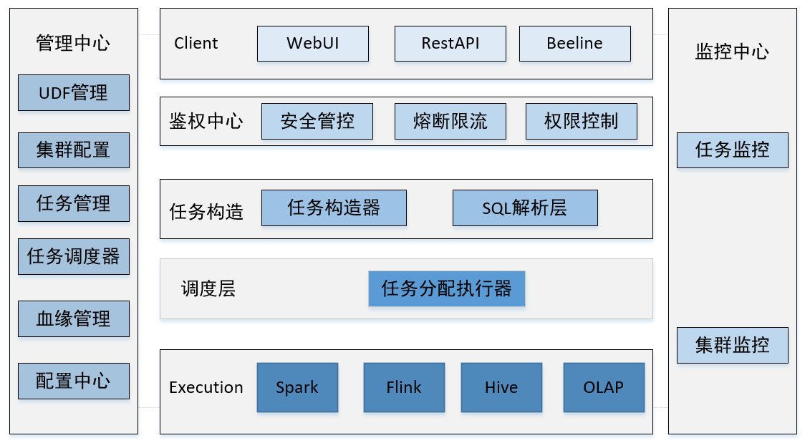

# CWS  
# 1.概述  
计算服务工作站(Computing WorkStation,CWS)提供支持Flink，Spark，Hive等计算引擎的可视化任务提交，并提供任务监控等功能。  
  
# 2.说明  
   CWS致力于为主流的分布式计算引擎，如 Flink, Spark等，提供统一的、一站式的任务提交、任务监控、集群监控能力。CWS从上到下依次包含Client、鉴权中心、任务构造层、调度层以及执行层。  
   + client层：为用户接入cws提供客户端支持，例如WebUI、RestAPI(方便用于和cws集成)、JDBC以及Beeline等。cws即支持通过WebUI提供的工具，图形化的任务构造并提交，也可以通过提供的JDBC或WebUI使用SQL提交任务。  
   + 鉴权中心：为保证cws自身安全以及底层大数据计算引擎的安全，cws在client层下设置鉴权中心，主要功能包括安全管控、熔断限流、权限控制等。  
   + 任务构造：任务构造层负责经接收到用户请求转化为可执行的任务（Java程序或SQL）并提交给调度层，由调度层调度到具体的引擎上。任务构造器负责将通过图形化工具构造的任务转化成Java程序，SQL解析层负责解析用户的SQL明确用户想使用的引擎。  
   + 调度层：调度层接收任务构造层的输出，将任务提交到用户指定的分布式计算引擎。  
   + Execution:执行层，cws本身不提供计算能力，其计算能力依赖于开源的大数据计算引擎，例如Flink,Spark,Hive以及Presto等OLAP引擎；  
     
   此外,cws提供管理中心进行诸如UDF、DDL、任务调度（基于azkaban）等管理工作；监控中心对任务或集群的状态进行监控，例如可以实时监控Flink作业的
   metric信息
# 3.进度计划  
   由于本人有具体的工作要做，所以只能利用业务时间进行开发，暂定进度如下：  
   第一阶段(截止到2021-12)：以打通整个任务提交工作流为主
   * client层：实现基于WebUI和RestAPI两种通过SQL提交任务的模式；
   * 鉴权中心：暂时实现全部请求均通过的模式，即所有请求都可以传递任务构造层；
   * 任务构造层：实现SQL解析层；
   * 调度层：调度层实现SQL调度功能；
   * Execution: 支持Flink和PG等关系型数据库
   
   第二阶段（截止到2022-4月）：以完善任务提交流程，并支持更多引擎为主：  
  * client层：完善WebUI的任务提交功能，具体可视化任务提交任务能力
  * 鉴权中心：实现权限控制等功能；
  * 任务构造层：实现通过任务构造器，支撑client层形化的任务构成形式
  * 调度层：实现支持Java程序的任务分发，实现完整的调度层功能；
  * Execution: 支持Spark,Hive等计算引擎
  
  第三阶段（截止到2022-8月）：以实现管理中心主要功能为主  
  第四阶段（截止到2022-12月）：以实现监控中心主要功能为主  
# 4.其他  
欢迎有志向的小伙伴一起加入，一起迈向伟大 xiankai0216@foxmail.com
    
